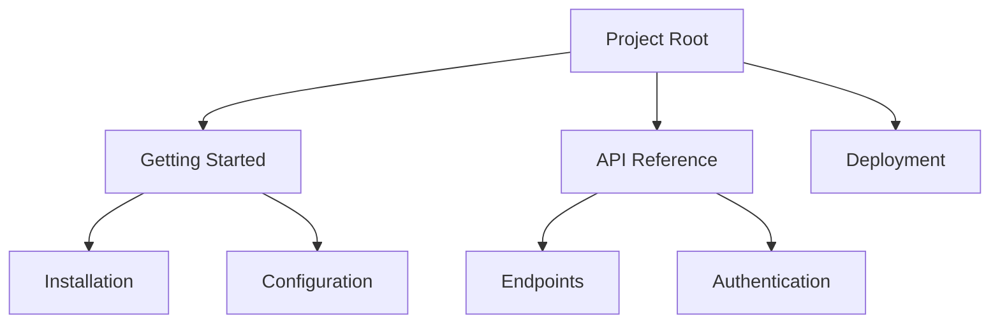

## Overview

Master the core concepts of aisten Documentation to organize your project knowledge efficiently. You build structured docs using pages, hierarchies, and version control. Leverage collaboration tools and search features to keep your team aligned and information accessible.

<Columns cols={2}>
  <Card title="Project Hierarchies" icon="layers" href="#">
    Organize content into nested structures for intuitive navigation.
  </Card>
  <Card title="Version Control" icon="git-branch" href="#">
    Track changes with Git integration for reliable history.
  </Card>
  <Card title="Collaboration" icon="users" href="#">
    Enable team editing, reviews, and real-time updates.
  </Card>
  <Card title="Search Features" icon="search" href="#">
    Discover content quickly with full-text search and tags.
  </Card>
</Columns>

## Project Organization and Hierarchies

You structure your documentation using a hierarchical system of pages and sections. Start with a root project, then create nested pages for topics like guides, APIs, and FAQs. This mirrors your project's architecture for easy navigation.



Use tables to plan your hierarchy:

| Level | Example Pages | Purpose |
|-------|---------------|---------|
| Root | Home, Changelog | Entry points |
| L1 | Guides, APIs | Major sections |
| L2 | Quickstart, Endpoints | Subtopics |
| L3 | Install, Auth | Details |

<Steps>
  <Step title="Create Hierarchy" icon="layers">
    Navigate to your project dashboard.
    
    Click `New Page` and select parent.
  </Step>
  <Step title="Reorder Pages" icon="move">
    Drag pages in the sidebar to adjust order.
  </Step>
  <Step title="Add Navigation" icon="menu">
    Enable sidebar menu for automatic linking.
  </Step>
</Steps>

## Version Control Basics

Integrate Git to manage doc changes. You commit pages like code, enabling branches for drafts and merges for releases. Configure your repo in project settings.

<Tabs>
  <Tab title="GitHub" icon="github">
    Connect your repo via OAuth.
    
    ```yaml
    repo: aisten/docs-project
    branch: main
    path: docs/
    ```
  </Tab>
  <Tab title="GitLab" icon="git-branch">
    Use personal access token.
    
    ```yaml
    repo: git@gitlab.com:team/docs.git
    branch: develop
    ```
  </Tab>
</Tabs>

<CodeGroup tabs="CLI,UI">
  ```bash
  git add docs/concepts.mdx
  git commit -m "Update core concepts"
  git push origin main
  ```
  ```javascript
  // Pull latest via UI
  await aisten.pullDocs({ repo: 'aisten/docs' });
  ```
</CodeGroup>

<Callout kind="tip">
  Always commit atomic changes, like one concept per PR, for cleaner history.
</Callout>

## Collaboration Features

You invite team members with roles: editor, reviewer, or viewer. Use comments for feedback and `@mentions` for notifications. Real-time editing prevents conflicts.

<Expandable title="Advanced Permissions" default-open="false">
  Customize roles:
  
  | Role | Edit Pages | Manage Users | Publish |
  |------|------------|--------------|---------|
  | Admin | Yes | Yes | Yes |
  | Editor | Yes | No | No |
  | Viewer | No | No | No |
</Expandable>

## Search and Discoverability

Boost findability with tags, full-text search, and auto-generated indexes. Tag pages like `api`, `guide`, or `deployment` for filtered results.

<Callout kind="info">
  Search indexes update in `<1s` after saves. Use quotes for exact phrases: `"core concepts"`.
</Callout>

Add tags in frontmatter:

```yaml
tags: ["concepts", "hierarchy", "git"]
```

This setup ensures your docs scale with your project while staying discoverable.